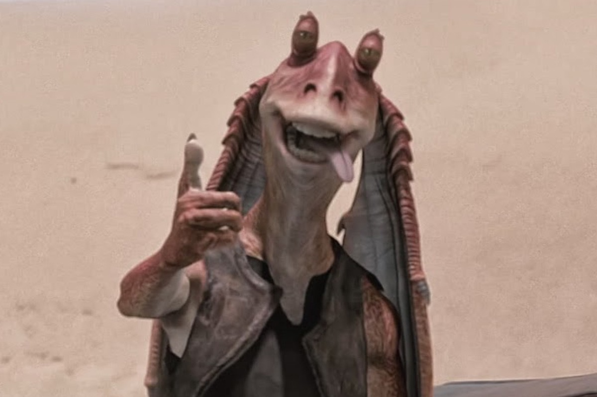

# AckBinks: A Star Wars Dataset

This dataset is used as part of the teaching material to demonstrate PyTorch programming and deep learning in general.

The material is presented as part of the "Deep Learning" lecture series at Durham University.

The images in this dataset have been scraped from the internet and do not belong to the author of this repository. As such, they can only be used for academic and research purposes.

---

## Content:

- This dataset is made up of two classes based on my two favourite characters in the Star Wars universe, namely:

- Admiral Ackbar

- Jar Jar Binks

There are 60 training images and 30 test images for each class in this dataset.

A larger dataset with more classes can be found here:
https://www.kaggle.com/datasets/mathurinache/star-wars-images

---